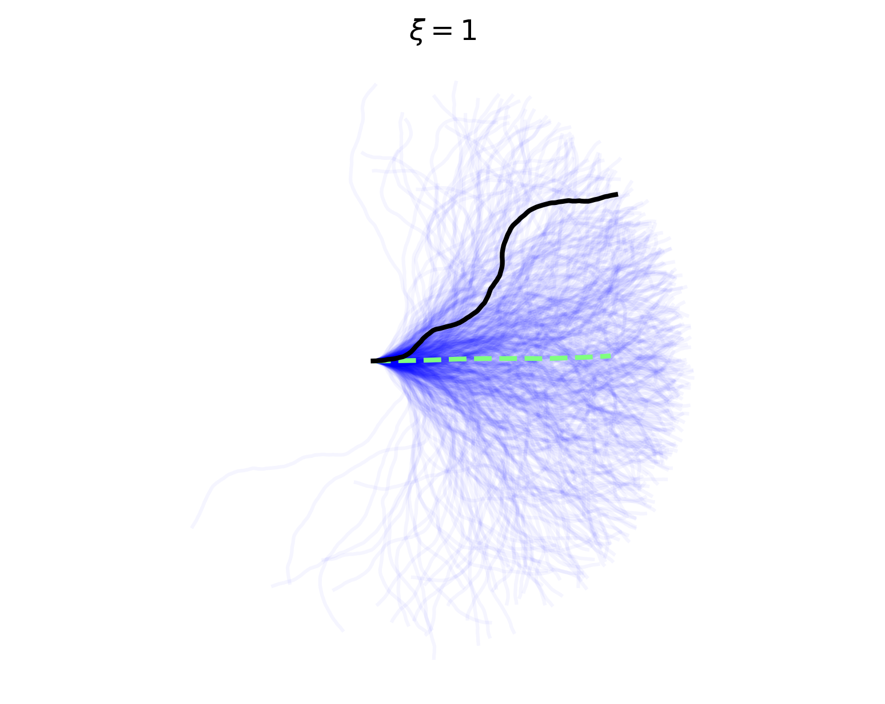

# Stochastic-Filament-Fourier-Generation
A simple Python simulation of semi-flexible polymers (Worm-Like Chain model) using Fourier series decomposition to generate thermal equilibrium configurations based on persistence length ξ.



## Physics
The code implements the **Worm-Like Chain (WLC)** model. Instead of discrete segments, the filament shape is generated by decomposing the curvature into Fourier modes with Gaussian-distributed amplitudes, ensuring the correct correlation function for a semi-flexible polymer in thermal equilibrium.

## Usage

### Prerequisites
* Python 3.x
* NumPy
* Matplotlib
* SciPy

### Installation
```bash
git clone [https://github.com/Lohenwolf/Stochastic-Filament-Fourier-Generation.git](https://github.com/Lohenwolf/Stochastic-Filament-Fourier-Generation.git)
cd Stochastic-Filament-Fourier-Generation
pip install -r requirements.txt
